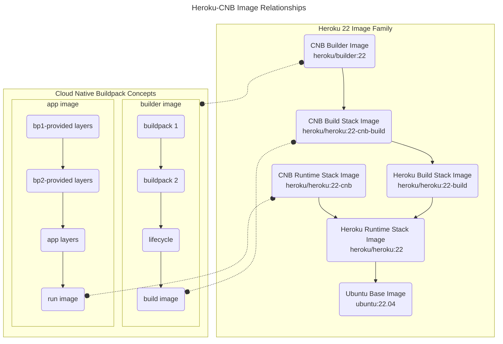

```mermaid
---
title: Heroku-CNB Image Relationships
---
graph TB
    subgraph HIF["Heroku 22 Image Family"]
        direction LR
        HIF_CNB_BUILDER("CNB Builder Image\n heroku/builder:22") --> HIF_CNB_BUILD
        HIF_CNB_BUILD("CNB Build Stack Image\n heroku/heroku:22-cnb-build") --> HIF_H_BUILD
        HIF_H_BUILD("Heroku Build Stack Image\n heroku/heroku:22-build") --> HIF_H_RUN
        HIF_CNB_RUN("CNB Runtime Stack Image\n heroku/heroku:22-cnb") --> HIF_H_RUN
        HIF_H_RUN("Heroku Runtime Stack Image\n heroku/heroku:22") --> HIF_BASE
        HIF_BASE("Ubuntu Base Image\n ubuntu:22.04")
    end
    
    subgraph CNB["Cloud Native Buildpack Concepts"]
        direction LR
        subgraph CNB_BUILDER_IMG["builder image"]
            direction TB
            CNB_BUILDER_IMG_BP1("buildpack 1") --> CNB_BUILDER_IMG_BP2
            CNB_BUILDER_IMG_BP2("buildpack 2") --> CNB_BUILDER_IMG_LC
            CNB_BUILDER_IMG_LC("lifecycle") --> CNB_BUILDER_IMG_BUILD
            CNB_BUILDER_IMG_BUILD("build image")
        end

        subgraph CNB_APP_IMG["app image"]
            direction TB
            CNB_APP_IMG_BP1("bp1-provided layers") --> CNB_APP_IMG_BP2
            CNB_APP_IMG_BP2("bp2-provided layers") --> CNB_APP_IMG_APP
            CNB_APP_IMG_APP("app layers") --> CNB_APP_IMG_RUN
            CNB_APP_IMG_RUN("run image")
        end
    end
    
    HIF_CNB_BUILDER o-.-o CNB_BUILDER_IMG
    HIF_CNB_BUILD o-.-o CNB_BUILDER_IMG_BUILD
    HIF_CNB_RUN o-.-o CNB_APP_IMG_RUN
```